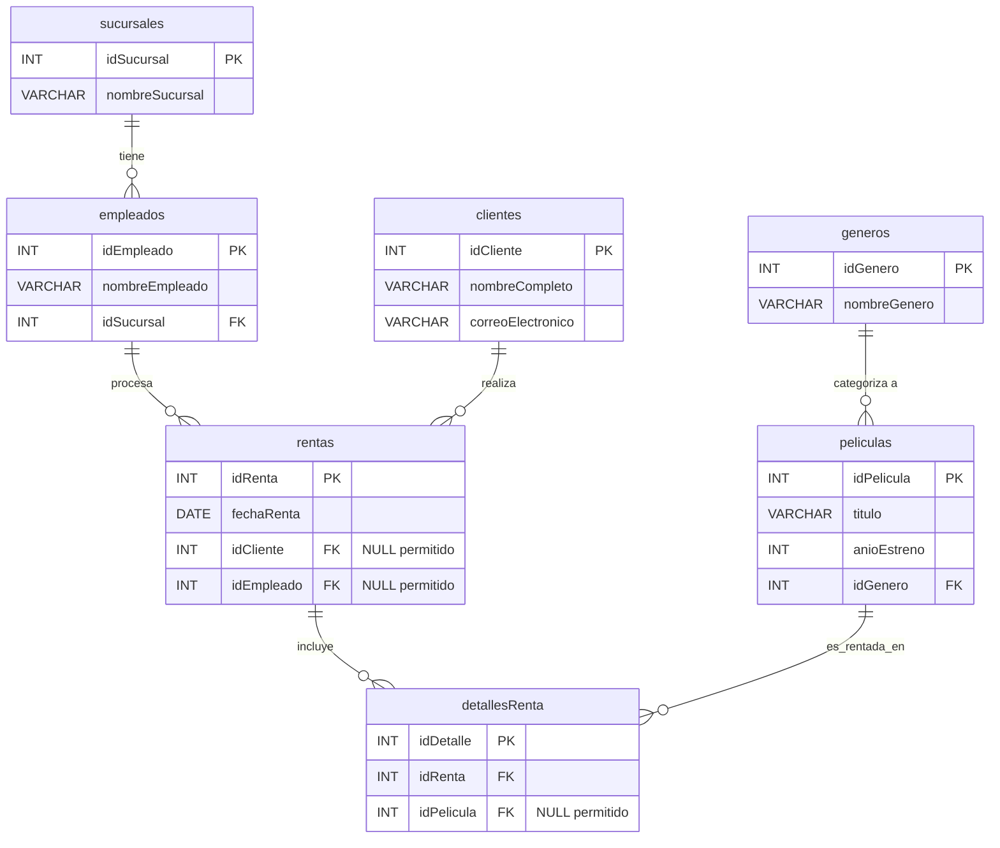

# Blockbuster Reborn – Ejercicio Práctico SQL JOIN

**Asignatura:** Bases de Datos Avanzadas
**Grupo:** 4

**Integrantes:**

*Daniel Casanova*

*Diego Páez*

*Edwin Rodriguez*

*Santiago Sánchez*
## Descripción del proyecto

*Blockbuster Reborn* es una cadena de renta de películas físicas que busca modernizarse. El negocio maneja tres tipos de renta:

- **Renta normal:** un cliente registrado (que acumula puntos) renta en una sucursal y lo atiende un empleado.
- **Renta express:** se renta sin registrar cliente (`idCliente` en `NULL`).
- **Renta de kiosko:** se hace en una máquina automática, sin empleado (`idEmpleado` en `NULL`).

En este proyecto se diseñó la base de datos `blockbusterReborn`, se cargó con datos de prueba y se construyeron 4 reportes de negocio usando los distintos tipos de `JOIN`: `INNER JOIN`, `LEFT JOIN`, `RIGHT JOIN` y un `FULL OUTER JOIN` emulado con `UNION`.

## Diagrama Entidad-Relación



## Reportes realizados

| Reporte | Pregunta de negocio | Tipo de JOIN |
|---|---|---|
| 1 | Ticket de compra completo (solo rentas perfectas) | `INNER JOIN` |
| 2 | Seguimiento de todos los clientes, rentaran o no | `LEFT JOIN` |
| 3 | Auditoría de todo el catálogo de películas | `RIGHT JOIN` |
| 4 | Conciliación total empleados ↔ rentas | `LEFT JOIN` + `UNION` + `RIGHT JOIN` (FULL OUTER JOIN emulado) |

## Cómo ejecutarlo

1. Abrir MySQL Workbench (o la consola `mysql`).
2. Ejecutar completo `1_esquema_y_datos.sql` (crea la base y carga los datos).
3. Ejecutar `2_consultas.sql` y revisar los 4 resultados.

Desde consola:

```bash
mysql -u root -p < 1_esquema_y_datos.sql
mysql -u root -p --table < 2_consultas.sql
```

> **Nota:** en Windows, MySQL tiene por defecto `lower_case_table_names = 1`, así que al hacer `SHOW TABLES` la tabla `detallesRenta` se ve como `detallesrenta`. En el script los nombres están en lowerCamelCase como pide el enunciado y las consultas funcionan igual.

## Tecnologías utilizadas

- **MySQL Server 8.0** – motor de base de datos.
- **MySQL Workbench 8.0 / consola `mysql`** – ejecución de los scripts.
- **SQL** – DDL (`CREATE`), DML (`INSERT`) y DQL (`SELECT` con `JOIN`).
- **Mermaid** – diagrama entidad-relación en el README.
- **Git y GitHub** – control de versiones y entrega.
